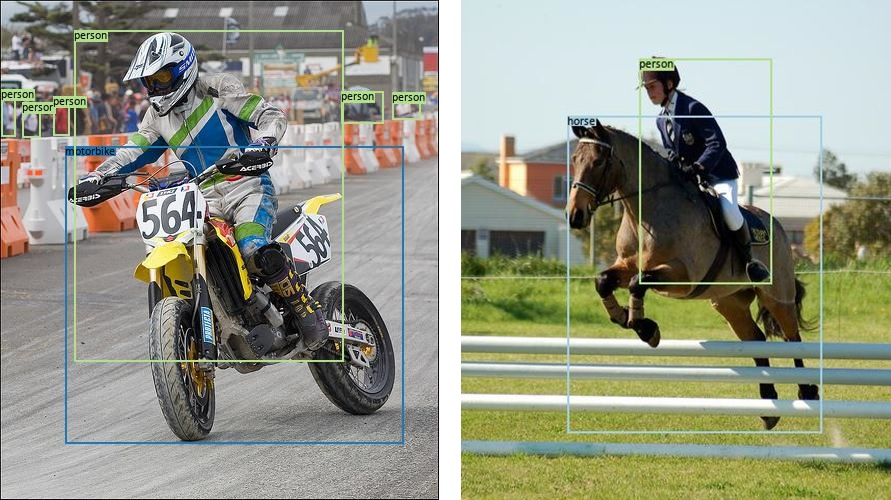

# Dataset-groundtruth

> Visualize the groundtruth of multiple datasets.

우리는 여러 데이터셋(COCO, VOC, etc.)을 사용하여 딥러닝 모델을 학습시키고 테스트합니다. 이러한 데이터셋은 훈련 데이터셋과 테스트 데이터셋으로 구분되며 각각에는 이미지 파일과 정답 데이터 파일이 들어있습니다.

이때 정답 데이터 파일은 xml 또는 json으로 이루어져 있어, 사람이 직관적으로 확인하기가 힘듭니다. 특히 테스트 데이터셋으로 모델을 평가할 때 정답 이미지가 없으면 평가 결과를 비교하기가 어렵습니다. 따라서 정답 데이터 파일을 프로그램으로 처리하여 사람이 보기 쉽도록 시각화합니다.

이 프로젝트가 많은 사용자에게 유용히 사용되면 좋겠습니다.

## Project Introduction

- Motivation
  - 정답 데이터 파일이 xml 또는 json이므로 사람이 한눈에 보기 어렵다.
- Purpose
  - 직관적으로 확인하기 어려운 정답 정보를 보기 쉽도록 시각화한다.
- Main functions
  1. Object Detection
     - 정답 데이터에 있는 bounding box 좌표를 사용하여 이미지에 box를 그린다.

## Build Status


## How to Install

1. Anaconda 또는 Miniconda가 설치되어 있는지 확인하세요.

2. 새 가상환경을 만들고 아래의 개발 환경 섹션에서 언급한 라이브러리를 설치하세요.

   - ```python
     conda install python=3.7 matplotlib tqdm
     ```

   - https://pytorch.org/get-started/locally/

3. 리포지토리를 클론, 포크하거나 압축파일로 코드를 다운로드하세요.

## How to Use, Example

1. 사용할 가상환경을 활성화하고 데이터셋의 경로를 확인합니다.

2. 아래의 명령을 실행합니다. 여기서 [ ]는 사용자의 환경에 맞게 수정하십시오.

   ```python
   python [filename].py --dataset=[path to dataset] --dataset_download=[True / False] --save_folder=[path to saving result folder]
   ```

3. 결과 이미지가 저장된 폴더로 가서 결과를 확인합니다.




## Functions

- 지원하는 데이터셋
  1. Pascal VOC
- 지원하는 분야
  1. Object Detection: 정답 데이터에 있는 bounding box 좌표를 사용하여 이미지에 box를 그린다.

## API, Framework

- PyTorch 1.5.0
- Matplotlib
- Python 3.7.7
- Tqdm

## Develop environment

- H/W develop environment
  - Hardware independent
- S/W develop environment
  - Ubuntu 20.04 LTS (Cross platform)
  - Windows10 20H1 (Cross platform)
  - Miniconda
- Setting up develop environment
  1. Make sure you have Anaconda or Miniconda installed.
  2. Create a new virtual environment and install the above library.
  3. Download the code to your repository as a clone, fork or ZIP file.
  4. Open the downloaded file with your IDE or text editor.
  5. Start coding~!

## Contribution method

1. Fork this repository.
2. Create a new branch or use the master branch in the GitHub Desktop.
3. Commit the modification.
4. Push on the selected branch.
5. Please send a pull request.

## License

MIT License

You can find more information in `LICENSE`.
